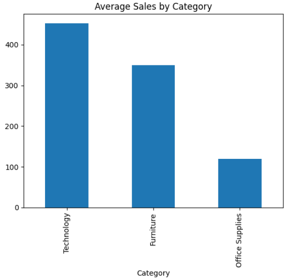
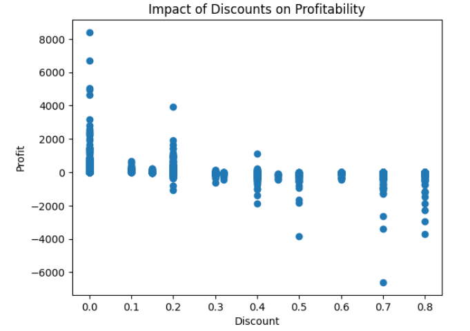
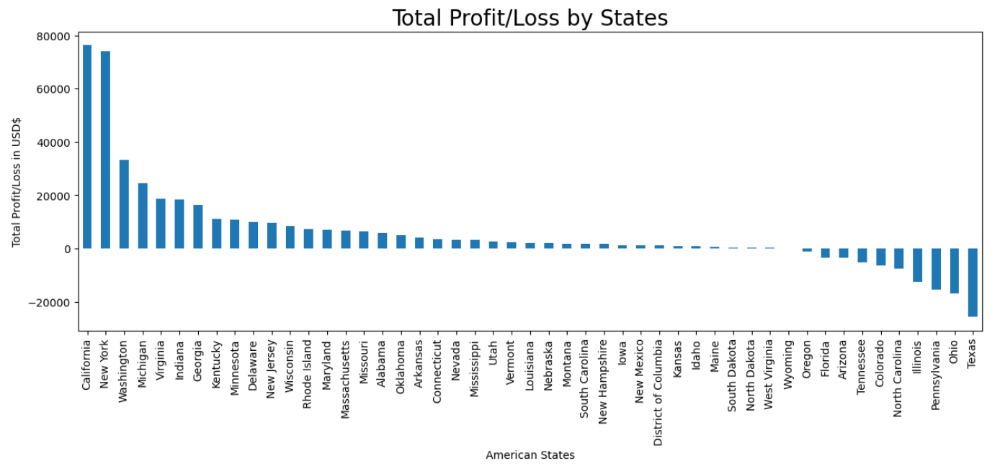

# Retail Sales & Profitability Analysis

This project analyzes retail sales data to identify key drivers of profitability, with a focus on discount strategy, product performance, and customer segmentation.

---

## Tools

- Python (Pandas, Matplotlib)
- Jupyter Notebook

---

## Project Goals

- Analyze sales and profit across product categories and sub-categories
- Evaluate the impact of discount strategies on profitability
- Identify high- and low-performing segments of the business

---

## Key Insights

- Discount strategy is the primary driver of profitability, with higher discounts leading to consistent margin erosion  
- Technology is the most profitable category despite lower discounting  
- Furniture underperforms due to loss-making sub-categories (Tables, Bookcases)  
- Consumer segment contributes the majority of sales and profit  

---

## Sample Visualizations

### Category Performance

### Discount vs Profit

### Profit by State

---

## Project Status

Completed (Python analysis).  
Next step: expanding into SQL-based analysis.

---

## About Me

Data Analyst with experience in cybersecurity and retail analytics, currently working at Siemens Energy. I focus on building analytical solutions that translate complex data into clear, actionable insights.
